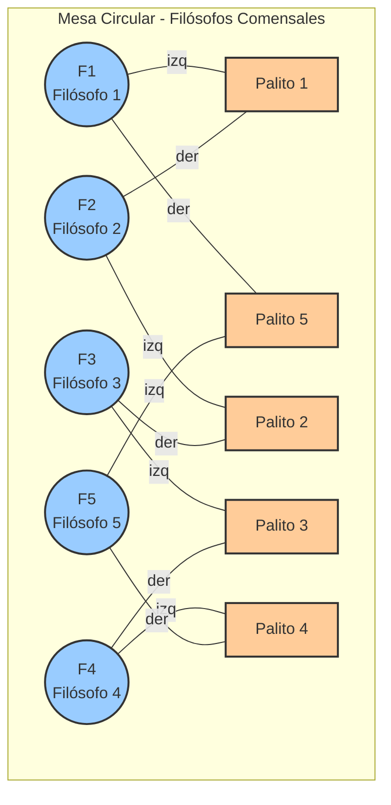

```mermaid
gantt
    title Concurrencia vs Paralelismo
    dateFormat s
    axisFormat %S

    section Concurrencia (1 CPU)
    Proceso A    :a1, 0, 1s
    Proceso B    :b1, after a1, 1s
    Proceso A    :a2, after b1, 1s
    Proceso C    :c1, after a2, 1s
    Proceso B    :b2, after c1, 1s
    Proceso A    :a3, after b2, 1s
    Proceso C    :c2, after a3, 1s

    section Paralelismo CPU 1
    Proceso A    :pa1, 0, 4s

    section Paralelismo CPU 2
    Proceso B    :pb1, 0, 2s
    Proceso C    :pc1, after pb1, 2s
```

# Concurrencia y Sincronización en Sistemas Informáticos
## Unidad 4: Pensar en Estructuras y Procesos

---

## Introducción

¿Qué pasa cuando varias personas intentan usar el mismo baño al mismo tiempo? ¿O cuando varios estudiantes quieren imprimir en la misma impresora? ¿Cómo se organizan los autos en un semáforo?

Estos problemas cotidianos son análogos a los que enfrentan las computadoras cuando múltiples procesos necesitan compartir recursos limitados. En esta unidad aprenderemos a **pensar** sobre estos problemas, **visualizarlos** y **razonar** sobre posibles soluciones.

---

## 1. Conceptos Fundamentales
### 1.1 La Metáfora de la Cocina Compartida
Imagina una cocina compartida en una residencia estudiantil:

- **Procesos** = Los estudiantes que quieren cocinar
- **Recursos compartidos** = La hornalla, el horno, los demás elementos
- **Concurrencia** = Varios estudiantes quieren cocinar al mismo tiempo
- **Sincronización** = Las reglas para coordinar quién usa qué y cuándo

**Escenario 1: Sin coordinación**
```
Estudiante A está usando la hornalla para hervir agua
Estudiante B necesita la hornalla para freír
Estudiante C también necesita la hornalla para saltear

→ Conflicto: Solo hay una hornalla
→ Necesitamos REGLAS para organizarnos
```
**Escenario 2: Con coordinación**
```
Regla: Quien llega primero, usa la hornalla hasta terminar
Los demás esperan su turno en orden de llegada
```

### 1.2 Procesos e Hilos: ¿Qué son?
**Proceso**: Un programa en ejecución
- Ejemplo: Tu navegador Chrome es un proceso
- Ejemplo: Word abierto es otro proceso
- Cada proceso tiene su propia "memoria" separada

**Hilo (Thread)**: Una tarea dentro de un proceso
- Ejemplo: En Chrome, una pestaña puede ser un hilo
- Ejemplo: En Word, el corrector ortográfico puede ser otro hilo
- Los hilos de un mismo proceso comparten recursos

**Analogía visual:**
```
PROCESO = Casa
├── HILO 1 = Persona cocinando
├── HILO 2 = Persona limpiando
└── HILO 3 = Persona estudiando

Todos en la misma casa (comparten cocina, baño, living)
```

### 1.3 Concurrencia vs. Paralelismo

**Concurrencia** = Gestionar múltiples tareas intercalándolas

Imagina un chef que:
```
Minuto 1-2: Pica cebolla
Minuto 3-4: Revisa el horno
Minuto 5-6: Sigue picando
Minuto 7-8: Revisa el horno de nuevo
```
→ Una persona, múltiples tareas, se va turnando

**Paralelismo** = Ejecutar múltiples tareas simultáneamente

Imagina dos chefs trabajando al mismo tiempo:
```
Chef A: Pica cebolla continuamente
Chef B: Vigila el horno continuamente
```
→ Dos personas, dos tareas, en verdadero paralelo

**Diagrama:**


---

## 2. El Problema de las Condiciones de Carrera

### 2.1 ¿Qué es una Condición de Carrera?

Una **condición de carrera** (race condition) ocurre cuando el resultado de un programa depende del **orden** en que se ejecutan las operaciones.

**Ejemplo del Mundo Real: El Último Asiento en el Cine**

```
Situación inicial: 1 asiento libre en la sala

Persona A:                     Persona B:
1. Mira la pantalla           1. Mira la pantalla
2. Ve "1 asiento libre"       2. Ve "1 asiento libre"
3. Decide comprar             3. Decide comprar
4. Presiona "Comprar"         4. Presiona "Comprar"

¿Resultado? ¡El sistema vendió 2 entradas para 1 asiento!
```

### 2.2 Ejemplo Clásico: La Cuenta Bancaria Compartida

María y José comparten una cuenta con $1000.

**Operación de María (Depositar $500):**
```
Paso 1: Leer saldo actual → $1000
Paso 2: Calcular nuevo saldo → $1000 + $500 = $1500
Paso 3: Guardar nuevo saldo → $1500
```

**Operación de José (Retirar $300):**
```
Paso 1: Leer saldo actual → $1000
Paso 2: Calcular nuevo saldo → $1000 - $300 = $700
Paso 3: Guardar nuevo saldo → $700
```

**¿Qué pasa si se ejecutan al mismo tiempo?**

```
Línea de Tiempo:

t=0: SALDO = $1000

t=1: María lee saldo → obtiene $1000
t=2: José lee saldo → obtiene $1000 (¡María aún no escribió!)
t=3: María calcula → $1000 + $500 = $1500
t=4: José calcula → $1000 - $300 = $700
t=5: María guarda → SALDO = $1500
t=6: José guarda → SALDO = $700

¡El depósito de María se perdió!
```

**Resultado esperado:** $1200
**Resultado real:** $700 o $1500 (¡depende de quién escriba último!)

### 2.3 Ejercicio Mental: El Contador

Dos personas deben incrementar un contador 1000 veces cada una.

```
Contador inicial = 0

Persona A: hacer 1000 veces { contador = contador + 1 }
Persona B: hacer 1000 veces { contador = contador + 1 }

¿Resultado esperado? 2000
¿Resultado real? Puede ser cualquier número entre 1000 y 2000
```

**¿Por qué?**

La operación "contador = contador + 1" NO es atómica. Requiere:
1. **LEER** el valor actual
2. **SUMAR** 1
3. **ESCRIBIR** el resultado

Si A y B **leen** al mismo tiempo, pueden **sobrescribirse** mutuamente.

---

## 3. Sección Crítica: El Concepto Clave

### 3.1 Definición

Una **sección crítica** es una parte del código donde se accede a un recurso compartido.

**Regla de oro:** Solo UN proceso/hilo puede ejecutar la sección crítica a la vez.

### 3.2 Analogía: El Baño Compartido

```
SECCIÓN CRÍTICA = Estar dentro del baño

Protocolo:
1. Intentar entrar (verificar si está libre)
2. Si está libre → Entrar y CERRAR CON LLAVE
3. Usar el baño
4. Salir y ABRIR LA PUERTA

La llave = Mecanismo de sincronización
```

### 3.3 Estructura General

```
PROTOCOLO DE ENTRADA
    (pedir permiso, esperar si es necesario)

SECCIÓN CRÍTICA
    (acceder al recurso compartido)

PROTOCOLO DE SALIDA
    (liberar el recurso para otros)

RESTO DEL CÓDIGO
    (trabajo que no necesita el recurso)
```

---

## 4. Mecanismos de Sincronización

### 4.1 El Semáforo: Un Guardián del Recurso

Un **semáforo** es como un guardia de seguridad que controla cuántas personas pueden entrar.

**Elementos:**
- Un **contador** (cuántos pueden entrar)
- Una **cola de espera** (quién está esperando)

**Operaciones:**
1. **ESPERAR / TOMAR / WAIT**: "¿Puedo entrar?"
   - Si contador > 0 → Decrementar y pasar
   - Si contador = 0 → Ir a la cola de espera

2. **SEÑALAR / LIBERAR / SIGNAL**: "Ya terminé"
   - Incrementar contador
   - Si hay alguien esperando → Permitirle pasar

**Ejemplo Visual: Estacionamiento**

```
ESTACIONAMIENTO CON 3 ESPACIOS
Semáforo iniciado con valor = 3

Auto 1 llega:
  - ESPERAR → contador baja a 2 → Entra
  
Auto 2 llega:
  - ESPERAR → contador baja a 1 → Entra
  
Auto 3 llega:
  - ESPERAR → contador baja a 0 → Entra
  
Auto 4 llega:
  - ESPERAR → contador = 0 → ¡DEBE ESPERAR!
  
Auto 1 sale:
  - SEÑALAR → contador sube a 1 → Auto 4 puede entrar
```

### 4.2 Tipos de Semáforos

**Semáforo Binario** (Mutex = Mutual Exclusion)
```
Valores posibles: 0 o 1
Uso: Proteger secciones críticas
Equivalente a: Un baño con una sola persona
```

**Semáforo Contador**
```
Valores posibles: 0, 1, 2, 3, ...
Uso: Recursos múltiples limitados
Equivalente a: Estacionamiento con N espacios
```

### 4.3 Solución a la Cuenta Bancaria

```
SEMÁFORO mutex = 1 (inicialmente libre)

Operación Depositar:
  1. ESPERAR(mutex)           ← Pedir permiso
  2. Leer saldo
  3. Calcular nuevo saldo
  4. Guardar nuevo saldo
  5. SEÑALAR(mutex)           ← Liberar para otros

Operación Retirar:
  1. ESPERAR(mutex)           ← Pedir permiso
  2. Leer saldo
  3. Calcular nuevo saldo
  4. Guardar nuevo saldo
  5. SEÑALAR(mutex)           ← Liberar para otros
```

Ahora **NO PUEDE** haber race condition porque solo uno accede a la vez.

---

## 5. Problemas Clásicos de Sincronización

### 5.1 El Problema de los Comensales y Filósofos Chinos

**Historia:** Cinco filósofos sentados en una mesa circular. Entre cada par hay un palito. Para comer, cada filósofo necesita DOS palitos (izquierdo y derecho).

**Diagrama:**


**Ciclo de vida de un filósofo:**
```
REPETIR SIEMPRE:
  - PENSAR (no necesita palitos)
  - Tomar palito izquierdo
  - Tomar palito derecho
  - COMER
  - Soltar palito izquierdo
  - Soltar palito derecho
```

**Problema 1: DEADLOCK**

```
¿Qué pasa si todos hacen esto?

t=1: F1 toma T1
t=2: F2 toma T2
t=3: F3 toma T3
t=4: F4 toma T4
t=5: F5 toma T5

¡Todos esperan el palito derecho que ya está tomado!
→ DEADLOCK: Nadie puede avanzar, todos bloqueados
```

**Problema 2: INANICIÓN**

Imagina que F1 y F2 comen muy rápido y se turnan constantemente. F3 nunca logra conseguir ambos palitos.
→ INANICIÓN: F3 espera infinitamente

**Posibles Soluciones:**

**Solución 1: Orden asimétrico**
```
Filósofos impares (F1, F3, F5):
  - Primero toman izquierdo, luego derecho

Filósofos pares (F2, F4):
  - Primero toman derecho, luego izquierdo

→ Rompe la simetría, previene deadlock
```

**Solución 2: Máximo de comensales**
```
Máximo 4 filósofos pueden intentar comer simultáneamente
(usando un semáforo con contador = 4)

→ Siempre al menos uno podrá tomar ambos palitos
```

**Solución 3: Todo o nada**
```
Un filósofo solo puede tomar AMBOS palitos simultáneamente
(dentro de una sección crítica protegida)

→ Previene tomar uno y esperar el otro
```

### 5.2 El Problema del Productor-Consumidor

**Escenario:** 
- **Productores**: Fabrican productos y los ponen en un almacén
- **Consumidores**: Toman productos del almacén
- **Almacén**: Tiene capacidad limitada (ej: 10 espacios)

**Diagrama:**
```
PRODUCTORES          ALMACÉN           CONSUMIDORES
                   [  ][  ][  ]
P1 →               [  ][  ][  ]          → C1
P2 →               [  ][  ][  ]          → C2
P3 →               [  ][  ][ ]           → C3
                   (capacidad: 10)
```

**Problemas a resolver:**
1. **Almacén lleno:** Productor debe esperar hasta que haya espacio
2. **Almacén vacío:** Consumidor debe esperar hasta que haya productos
3. **Acceso simultáneo:** Solo uno a la vez puede agregar/quitar
**Solución conceptual:**
```
SEMÁFOROS NECESARIOS:

espacios_libres = 10    (inicialmente el almacén está vacío)
productos = 0           (no hay productos al inicio)
mutex = 1               (para acceso exclusivo al almacén)

PRODUCTOR:
  1. Crear un producto
  2. ESPERAR(espacios_libres)    ← Verificar que hay espacio
  3. ESPERAR(mutex)              ← Pedir acceso exclusivo
  4. Poner producto en almacén
  5. SEÑALAR(mutex)              ← Liberar acceso
  6. SEÑALAR(productos)          ← Indicar que hay un producto más


CONSUMIDOR:
  1. ESPERAR(productos)          ← Verificar que hay productos
  2. ESPERAR(mutex)              ← Pedir acceso exclusivo
  3. Tomar producto del almacén
  4. SEÑALAR(mutex)              ← Liberar acceso
  5. SEÑALAR(espacios_libres)    ← Indicar que hay un espacio más
  6. Usar el producto
```

### 5.3 El Problema de Lectores-Escritores
**Escenario:** Una base de datos compartida
- **Lectores:** Solo leen datos (pueden varios simultáneamente)
- **Escritores:** Modifican datos (solo uno a la vez, sin lectores)

**Reglas:**
1. Múltiples lectores pueden leer al mismo tiempo
2. Solo un escritor puede escribir a la vez
3. No puede haber lectores mientras hay un escritor
4. No puede haber escritores mientras hay lectores

**Diagrama de estados:**
```
Estado 1: [L L L L] → 4 lectores leyendo (OK)
Estado 2: [E] → 1 escritor escribiendo (OK)
Estado 3: [L E] → ¡PROHIBIDO!
Estado 4: [E E] → ¡PROHIBIDO!
```

**Solución conceptual:**
```
VARIABLES COMPARTIDAS:
numero_lectores = 0     (cuántos están leyendo)
mutex_lectores = 1      (protege numero_lectores)
recurso = 1             (protege la base de datos)


LECTOR:
  1. ESPERAR(mutex_lectores)
  2. numero_lectores = numero_lectores + 1
  3. SI numero_lectores == 1 ENTONCES
       ESPERAR(recurso)           ← Primer lector bloquea escritores
  4. SEÑALAR(mutex_lectores)
  
  5. LEER DATOS
  
  6. ESPERAR(mutex_lectores)
  7. numero_lectores = numero_lectores - 1
  8. SI numero_lectores == 0 ENTONCES
       SEÑALAR(recurso)           ← Último lector libera escritores
  9. SEÑALAR(mutex_lectores)


ESCRITOR:
  1. ESPERAR(recurso)             ← Espera que NO haya lectores ni escritores
  2. ESCRIBIR DATOS
  3. SEÑALAR(recurso)             ← Libera para otros
```

**Variantes del problema:**
- **Prioridad a lectores:** Los escritores pueden esperar mucho (inanición)
- **Prioridad a escritores:** Los lectores pueden esperar mucho
- **Justicia:** Orden de llegada (más complejo de implementar)

### 5.4 El Problema de la Barbería Durmiente

**Escenario:**
- 1 barbero que duerme si no hay clientes
- N sillas de espera en la sala
- Clientes llegan aleatoriamente

**Reglas:**
1. Si no hay clientes, el barbero duerme
2. Cliente que llega despierta al barbero si está durmiendo
3. Si todas las sillas están ocupadas, el cliente se va
4. Un cliente a la vez recibe el corte

**Diagrama:**
```
BARBERÍA:
┌─────────────────────────┐
│ Silla de corte: [  ]   │
│                         │
│ Sala de espera:        │
│ [X] [X] [ ] (3 sillas) │
│                         │
│ Barbero: 💤            │
└─────────────────────────┘
```

**Flujo de un cliente:**
```
CLIENTE llega:
  SI hay sillas disponibles ENTONCES:
    - Sentarse en sala de espera
    - Despertar al barbero (si está dormido)
    - Esperar su turno
    - Recibir corte de pelo
  SI NO:
    - Irse (barbería llena)


BARBERO:
  MIENTRAS VERDADERO:
    SI hay clientes esperando ENTONCES:
      - Llamar al siguiente cliente
      - Cortar el pelo
    SI NO:
      - Dormir hasta que llegue un cliente
```

**Solución conceptual:**

```
SEMÁFOROS:
clientes_esperando = 0      (cuántos esperan)
barbero_listo = 0           (barbero disponible)
mutex = 1                   (proteger contador)
MAX_SILLAS = 3


CLIENTE:
  1. ESPERAR(mutex)
  2. SI clientes_esperando < MAX_SILLAS ENTONCES:
       clientes_esperando = clientes_esperando + 1
       SEÑALAR(barbero_listo)     ← Despierta barbero
       SEÑALAR(mutex)
       ESPERAR(silla_de_corte)    ← Espera turno
       (Recibe corte)
     SI NO:
       SEÑALAR(mutex)
       (Se va)


BARBERO:
  MIENTRAS VERDADERO:
    ESPERAR(barbero_listo)        ← Duerme si no hay clientes
    ESPERAR(mutex)
    clientes_esperando = clientes_esperando - 1
    SEÑALAR(silla_de_corte)       ← Llama al cliente
    SEÑALAR(mutex)
    (Corta el pelo)
```

---

## 6. Algoritmo de Planificación: Round Robin

### 6.1 ¿Qué es la Planificación?

El **planificador (scheduler)** decide qué proceso usa el CPU y por cuánto tiempo.

**Analogía:** El profesor que decide qué estudiante presenta su trabajo.

### 6.2 Round Robin: La Rueda del Tiempo

**Idea:** Cada proceso recibe un **quantum** (porción fija de tiempo). Si no termina, va al final de la fila.

**Características:**
- Justo: todos reciben CPU eventualmente
- Bueno para sistemas interactivos
- No hay inanición

**Ejemplo Visual:**

```
PROCESOS:
P1 necesita 20 unidades de tiempo
P2 necesita 6 unidades de tiempo
P3 necesita 8 unidades de tiempo

Quantum = 4 unidades
```

**Ejecución:**

```
Tiempo:  0   4   8   12  16  20  24  28  30
         |---|---|---|---|---|---|---|---|
         P1  P2  P3  P1  P1  P2  P1  P3  P1
         (4) (4) (4) (4) (4) (2) (4) (4) (2)

Explicación:
t=0-4:   P1 ejecuta 4, le quedan 16
t=4-8:   P2 ejecuta 4, le quedan 2
t=8-12:  P3 ejecuta 4, le quedan 4
t=12-16: P1 ejecuta 4, le quedan 12
t=16-20: P1 ejecuta 4, le quedan 8
t=20-24: P2 ejecuta 2, TERMINA ✓
t=24-28: P1 ejecuta 4, le quedan 4
t=28-30: P3 ejecuta 4, TERMINA ✓
t=30-32: P1 ejecuta 4, TERMINA ✓
```

### 6.3 Métricas Importantes

**Tiempo de Espera:** Cuánto esperó en la cola
**Tiempo de Retorno:** Cuánto desde que llegó hasta que terminó
**Tiempo de Respuesta:** Cuánto hasta la primera ejecución

```
Para P2:
- Llegó en t=0
- Primera ejecución en t=4 → Tiempo de respuesta = 4
- Terminó en t=24 → Tiempo de retorno = 24
- Tiempo de espera = 24 - 6 = 18
```

### 6.4 Efecto del Quantum

**Quantum muy pequeño (ej: 1ms):**
- ✅ Muy interactivo, respuesta rápida
- ❌ Mucho tiempo perdido cambiando de proceso

**Quantum muy grande (ej: 1000ms):**
- ✅ Poco overhead de cambio
- ❌ Se vuelve FIFO (First In First Out), menos justo

**Quantum óptimo:** Balancear entre interactividad y eficiencia

---

## 7. Sincronización de Relojes: Algoritmo de Cristian

### 7.1 El Problema

En sistemas distribuidos, cada computadora tiene su propio reloj. Con el tiempo, estos relojes **se desincronizan**.

**¿Por qué es importante?**
- Logs y auditorías
- Ordenar eventos en sistemas distribuidos
- Seguridad (certificados, autenticación)

### 7.2 Algoritmo de Cristian (1989)

**Idea:** Un cliente pregunta la hora a un servidor de tiempo confiable.

**Protocolo:**

```
CLIENTE                          SERVIDOR
  |                                  |
t₀ |--- "¿Qué hora es?" ----------→ |
  |                                  | t_server = 10:00:00.050
  |                                  |
  | ←---- "10:00:00.050" -----------| 
t₂ |                                 |

RTT (Round Trip Time) = t₂ - t₀
Tiempo de viaje (ida) ≈ RTT / 2

Hora ajustada = t_server + (RTT / 2)
```

**Ejemplo Numérico:**

```
Cliente envía solicitud:     t₀ = 10:00:00.000
Servidor responde:           t_server = 10:00:00.050
Cliente recibe respuesta:    t₂ = 10:00:00.100

RTT = 0.100 segundos
Tiempo de viaje ≈ 0.050 segundos

Hora ajustada = 10:00:00.050 + 0.050 = 10:00:00.100

Error máximo = RTT/2 = 50 milisegundos
```

### 7.3 Suposiciones y Limitaciones

**Suposiciones:**
- Tiempo de ida ≈ Tiempo de vuelta
- La red no tiene demoras variables muy grandes

**Mejoras prácticas:**
- Hacer múltiples mediciones
- Descartar mediciones con RTT muy alto
- Promediar los mejores resultados
- Usar servidores redundantes (NTP - Network Time Protocol)

**Diagrama de múltiples mediciones:**

```
Medición 1: RTT = 120ms → Descartada (muy alta)
Medición 2: RTT = 90ms  → OK
Medición 3: RTT = 88ms  → OK (la mejor)
Medición 4: RTT = 92ms  → OK
Medición 5: RTT = 250ms → Descartada (muy alta)

Usar medición 3 (menor RTT = más precisa)
```

---

## 8. Deadlock: El Bloqueo Mutuo

### 8.1 ¿Qué es un Deadlock?

Situación donde dos o más procesos están **bloqueados permanentemente**, esperando recursos que otros tienen.

**Analogía del Mundo Real:**

```
CRUCE DE CALLES:

Auto A viene del Norte, quiere ir al Sur (necesita cruzar)
Auto B viene del Este, quiere ir al Oeste (necesita cruzar)

Ambos llegan al cruce simultáneamente:
→ A espera que B avance
→ B espera que A avance
→ DEADLOCK: Ninguno puede avanzar
```

### 8.2 Las Cuatro Condiciones de Coffman

Para que haya deadlock, deben cumplirse **las 4 condiciones**:

**1. Exclusión Mutua:**
```
El recurso no puede compartirse
Ejemplo: Un palito solo puede usarlo un filósofo
```

**2. Retención y Espera:**
```
Un proceso retiene recursos mientras espera otros
Ejemplo: Filósofo tiene palito izquierdo, espera el derecho
```

**3. No Apropiación:**
```
No se pueden quitar recursos por la fuerza
Ejemplo: No puedes arrancarle el palito a un filósofo
```

**4. Espera Circular:**
```
Cadena circular de esperas
Ejemplo:
  P1 espera recurso de P2
  P2 espera recurso de P3
  P3 espera recurso de P1
```

### 8.3 Diagrama de Asignación de Recursos

```
EJEMPLO DE DEADLOCK:

Proceso A tiene Recurso 1, necesita Recurso 2
Proceso B tiene Recurso 2, necesita Recurso 1

   A ----necesita---→ R2
   ↑                   |
   |                   |
 tiene               tiene
   |                   |
   |                   ↓
   R1 ←---necesita--- B

Ciclo cerrado → DEADLOCK
```

### 8.4 Estrategias de Manejo

**1. PREVENCIÓN:** Eliminar una de las 4 condiciones

```
Eliminar Retención y Espera:
→ Un proceso debe solicitar TODOS los recursos al inicio

Eliminar Espera Circular:
→ Ordenar los recursos globalmente (R1, R2, R3, ...)
→ Siempre solicitar en orden creciente
```

**2. EVITACIÓN:** Algoritmo del Banquero

```
Antes de asignar un recurso, verificar:
¿El sistema quedará en estado seguro?

SI es seguro → Asignar
SI NO → Hacer esperar al proceso
```

**3. DETECCIÓN Y RECUPERACIÓN:**

```
Permitir deadlock, detectarlo y romperlo:
- Abortar procesos
- Quitar recursos y reasignar
```

**4. IGNORAR EL PROBLEMA:**

```
Asumir que deadlock es raro
(Estrategia de muchos sistemas operativos reales)
```

---

## 9. Problemas Adicionales para Pensar

### 9.1 El Puente de Un Solo Carril

**Descripción:**
- Puente permite tráfico en UNA dirección a la vez
- Varios autos pueden cruzar juntos en la misma dirección
- No puede haber autos en ambas direcciones simultáneamente

**Diagrama:**
```
Norte ↓              ↓ Sur
      ↓              ↓
      ↓  [PUENTE]    ↓
      ↓              ↓
      ↓              ↓
```

**Preguntas para pensar:**
1. ¿Qué pasa si muchos autos van Norte→Sur y siguen llegando?
2. ¿Los autos Sur→Norte podrían esperar infinitamente?
3. ¿Cómo darías prioridad sin causar inanición?

### 9.2 La Impresora Compartida

**Descripción:**
- Varios estudiantes quieren imprimir
- Solo un trabajo puede imprimirse a la vez
- Los trabajos deben respetarse en orden

**Preguntas para pensar:**
1. ¿Qué estructura de datos usarías? (pista: cola)
2. ¿Cómo evitas que dos personas impriman simultáneamente?
3. ¿Qué pasa si alguien envía un trabajo muy largo?

### 9.3 El Baño Unisex

**Descripción:**
- Baño puede ser usado por hombres o mujeres
- No ambos simultáneamente
- Varias personas del mismo género pueden usarlo juntas

**Preguntas para pensar:**
1. ¿En qué se parece al problema Lectores-Escritores?
2. ¿Cómo evitar que un grupo monopolice el baño?
3. ¿Necesitas diferentes semáforos para hombres y mujeres?

---

## 10. Conceptos ACID (Introducción)

En bases de datos y sistemas críticos, cuatro propiedades garantizan confiabilidad:

### A - Atomicidad
```
Una transacción es "todo o nada"

Ejemplo: Transferencia bancaria
  - Restar de cuenta A
  - Sumar a cuenta B
→ Ambas operaciones o ninguna
```

### C - Consistencia
```
El sistema pasa de un estado válido a otro válido

Ejemplo: La suma total de dinero en el banco no cambia
```

### I - Aislamiento (Isolation)
```
Las transacciones concurrentes no interfieren entre sí

Ejemplo: Dos personas haciendo transacciones
no ven los cambios de la otra hasta que terminen
```

### D - Durabilidad
```
Los cambios confirmados persisten ante fallos

Ejemplo: Si el sistema se cae después de confirmar,
los datos permanecen guardados
```

---

## Bibliografía

### Libros Fundamentales

1. **Silberschatz, A., Galvin, P. B., & Gagne, G.** (2018). *Operating System Concepts* (10th ed.). Wiley.
   - Capítulos 5-7: Procesos, sincronización, deadlock
   - Texto clásico, explicaciones visuales excelentes

2. **Tanenbaum, A. S., & Bos, H.** (2015). *Modern Operating Systems* (4th ed.). Pearson.
   - Capítulos 2-6: Muy didáctico, muchos ejemplos cotidianos

3. **Patterson, D. A., & Hennessy, J. L.** (2017). *Computer Organization and Design* (5th ed.). Morgan Kaufmann.
   - Capítulos sobre arquitectura y concurrencia

### Recursos Online y Videos

4. **Operating Systems: Three Easy Pieces (OSTEP)**
   - http://pages.cs.wisc.edu/~remzi/OSTEP/
   - Libro GRATUITO completo online
   - Muy didáctico, perfecto para principiantes

5. **CS50 - Harvard University**
   - https://cs50.harvard.edu/
   - Videos explicativos sobre fundamentos de computación

6. **Neso Academy - Operating Systems Playlist**
   - YouTube
   - Explicaciones paso a paso con diagramas

7. **Computerphile - YouTube Channel**
   - Videos sobre Dining Philosophers, Deadlock
   - Explicaciones visuales muy claras

### Artículos Clásicos

8. **Dijkstra, E. W.** (1965). "Solution of a problem in concurrent programming control"
   - El problema de los filósofos (artículo original)

9. **Coffman, E. G., Elphick, M., & Shoshani, A.** (1971). "System Deadlocks"
   - Las 4 condiciones del deadlock

10. **Cristian, F.** (1989). "Probabilistic clock synchronization"
    - Algoritmo de sincronización de relojes

### Herramientas de Visualización

11. **Process Scheduling Visualizer**
    - Sitios web interactivos para simular Round Robin

12. **Deadlock Detection Tools**
    - Visualizadores de grafos de recursos

---

## Guía de Estudio Autónomo (6 horas)

### Horas 1-2: Fundamentos y Race Conditions

**Lectura:**
- Secciones 1-3 de este documento
- Capítulo sobre procesos en OSTEP

**Actividad:**
- Dibujar al menos 3 líneas de tiempo de race conditions
- Inventar tu propio ejemplo del mundo real

**Pregunta clave:**
*¿Por qué "saldo = saldo + 100" no es atómico?*

### Horas 3-4: Problemas Clásicos

**Lectura:**
- Sección 5 completa (todos los problemas clásicos)
- Ver videos de Neso Academy sobre estos problemas

**Actividad:**
- Dibujar diagramas de los 4 problemas clásicos
- Para cada uno, identificar: recursos, procesos, semáforos

**Pregunta clave:**
*¿En qué se parecen Productor-Consumidor y la Barbería?*

### Horas 5-6: Round Robin, Cristian y Deadlock

**Lectura:**
- Secciones 6, 7 y 8

**Actividad:**
- Simular Round Robin con 4 procesos en papel
- Calcular tiempos de espera y retorno
- Dibujar un deadlock con 3 procesos y 3 recursos

**Pregunta clave:**
*¿Cómo prevendrías deadlock en la vida real?*

---

## Preparación para la Clase

### Materiales a Traer:
- Hojas en blanco para diagramas
- Lápices de colores (para dibujar flujos)
- Regla (opcional)

### Preguntas para Pensar:

1. ¿Qué otros ejemplos cotidianos de concurrencia conoces?
2. ¿Has experimentado un "deadlock" en la vida real?
3. ¿Cómo organizarías 5 amigos compartiendo 2 computadoras?
4. ¿Qué pasaría si tu banco no usara sincronización?

### Ejercicio Preparatorio:

Describe en lenguaje natural cómo resolverías:
*"3 chefs comparten 2 hornallas para cocinar 5 platos diferentes"*

- ¿Qué son los procesos?
- ¿Qué son los recursos?
- ¿Qué semáforos necesitas?
- ¿Cómo evitas deadlock?

---

## Glosario de Términos

| Término | Definición Simple |
|---------|------------------|
| **Atomicidad** | Operación que ocurre completamente o no ocurre |
| **Concurrencia** | Múltiples tareas progresando (intercaladas o paralelas) |
| **Deadlock** | Bloqueo mutuo permanente entre procesos |
| **Exclusión Mutua** | Solo uno a la vez en la sección crítica |
| **Hilo (Thread)** | Tarea dentro de un proceso |
| **Inanición** | Proceso nunca obtiene recursos (espera infinita) |
| **Mutex** | Semáforo binario para exclusión mutua |
| **Proceso** | Programa en ejecución |
| **Quantum** | Porción de tiempo en Round Robin |
| **Race Condition** | Resultado depende del orden de ejecución |
| **Recurso** | Elemento compartido (CPU, memoria, impresora, etc.) |
| **Sección Crítica** | Código que accede recursos compartidos |
| **Semáforo** | Mecanismo de sincronización con contador |
| **Sincronización** | Coordinación entre procesos concurrentes |

---

## Notas Finales

Este material está diseñado para **pensar** sobre concurrencia, no para programar todavía. El objetivo es desarrollar **intuición** sobre:

- Por qué existen estos problemas
- Cómo razonar sobre ellos
- Cómo visualizarlos con diagramas
- Cómo comunicar soluciones en lenguaje natural

En la clase trabajarán en grupos para:
- Dibujar escenarios
- Simular ejecuciones paso a paso
- Discutir alternativas
- Presentar soluciones conceptuales

**Recuerda:** No hay UNA respuesta correcta. Lo importante es el **razonamiento** y poder **explicar** por qué tu solución funciona.
*Fundamentos en Ciencias de la Computación - 2026*
