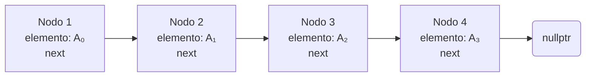

# Estructuras de datos
## Tipo de Dato Abstracto (TDA)
Es una abstracción matemática definida como un conjunto de objetos junto con un conjunto de operaciones que se pueden realizar sobre ellos.
Abstracción (El "Qué"): se enfoca únicamente en el comportamiento de los datos y las operaciones disponibles, sin ninguna mención de cómo se implementan esas operaciones.

### Ejemplos: 
Objetos como listas, conjuntos y grafos, junto con sus operaciones, pueden verse como TDAs. Conceptos fundamentales como los enteros y los booleanos también son tipos de datos.

### Operaciones: 
Para un TDA "Conjunto", las operaciones podrían incluir agregar, remover, tamaño y contiene. 
Una elección diferente de operaciones (por ejemplo: unión y encontrar) define un TDA distinto.

### Implementación y Diseño
* Encapsulamiento: El concepto de encapsulamiento permite implementar TDAs mediante el ocultamiento de los detalles de implementación. 
Otras partes del programa solo necesitan llamar al método apropiado para realizar una operación.
* Flexibilidad: Si se necesita cambiar la forma en que se implementa una operación, el cambio debería ser transparente para el resto del programa, siempre que las rutinas externas sigan llamando a los mismos métodos del TDA.
* Decisión de Diseño: No existe una regla fija sobre qué operaciones debe soportar cada TDA. Esto es una decisión de diseño que recae en el programador, al igual que el manejo de errores.

# Conclusión
Las estructuras de datos como **listas**, **pilas** y **colas** son ejemplos principales de TDAs. Se pueden implementar de diversas maneras, pero si se hace correctamente, el código que las utiliza no necesita saber qué implementación se eligió (por ejemplo, si una lista se implementa con un arreglo o con nodos enlazados).

## Listas
Una lista general tiene la forma A₀, A₁, A₂, ..., Aₙ₋₁, donde N es el tamaño de la lista. Una lista de tamaño 0 se denomina lista vacía.
### Propiedades:
- El elemento Aᵢ sigue (o sucede) a Aᵢ₋₁ (cuando i < N)
- El elemento Aᵢ₋₁ precede a Aᵢ (cuando i > 0)
- El primer elemento es A₀ y el último es Aₙ₋₁
- La posición del elemento Aᵢ en la lista es i

### Operaciones Comunes
* `printList`: Imprime todos los elementos de la lista
* `makeEmpty`: Vacía la lista
* `find(x)`: Retorna la posición de la primera ocurrencia de x
* `insert(x, pos)`: Inserta el elemento x en la posición especificada
* `remove(x)`: Elimina el elemento x de la lista
* `findKth(k)`: Retorna el elemento en la posición k
* `next(pos)`: Retorna la posición del sucesor
* `previous(pos)`: Retorna la posición del predecesor

**Ejemplo:**  Si la lista es 34, 12, 52, 16, 12:
- `find(52)` retorna 2
- `insert(x, 2)` produce 34, 12, x, 52, 16, 12
- `remove(52)` produce 34, 12, x, 16, 12

### Implementaciones de Listas
#### Implementación con Arreglos

| Nodo 1 | Nodo 2 | Nodo 3 | nullptr |
|----------|----------|----------|---------|
| elemento: A₀   | elemento: A₁ | elemento: A₂  | 

Ventajas:
- `printList` se ejecuta en tiempo lineal
- `findKth` toma tiempo constante O(1)
- Operaciones al final de la lista toman O(1) tiempo

Desventajas:
- Inserción y eliminación pueden ser costosas según la posición
- Insertar en posición 0 requiere desplazar todo el arreglo: O(N)
- Eliminar el primer elemento requiere desplazar todos los elementos: O(N)
- En promedio, se debe mover la mitad de la lista: tiempo lineal

``` Cuándo usar: Ideal cuando las inserciones ocurren principalmente al final de la lista y las operaciones son principalmente accesos (findKth).``` 

#### Implementación con Listas Enlazadas
Para evitar el costo lineal de inserción y eliminación, se utiliza una estructura donde los elementos no están almacenados contiguamente en memoria.

#### Estructura:
**Consiste en una serie de nodos no necesariamente adyacentes en memoria**
- Cada nodo contiene el elemento y un enlace (next) al nodo siguiente
- El último nodo apunta a  `nullptr `



##### Ejemplo de lista enlazada simple


##### Agregar elemento


##### Eliminar elemento


##### Lista doblemente enlazada


#### Complejidad de operaciones:
- `printList` y `find(x)`: Tiempo lineal O(N)
- `findKth(i)`: O(i) tiempo, menos eficiente que con arreglos
- `remove`: Se ejecuta con un cambio de puntero (tiempo constante)
- `insert`: Requiere obtener un nuevo nodo y ajustar dos punteros (tiempo constante)

Ventajas:
- Insertar o eliminar un elemento solo requiere cambiar enlaces, no mover elementos
- Agregar al frente o eliminar el primer elemento es O(1)
- No se necesita desplazar elementos cuando se conoce la posición del cambio

``` Cuándo usar: Ideal cuando las inserciones y eliminaciones ocurren en cualquier parte de la lista, especialmente al frente.```

## Stack - Pilas
Una pila es una estructura de datos conocida como LIFO (Last In, First Out - último en entrar, primero en salir).
<br>Operaciones fundamentales:

- `push(x)`: Inserta un elemento x en la pila (operación de entrada)
- `pop():` Elimina el elemento más recientemente insertado (operación de salida)
- `top()`: Examina el elemento en el tope sin eliminarlo (operación de salida)
- `makeEmpty()`: Vacía la pila
- `isEmpty()`: Verifica si la pila está vacía

### Características importantes:
- Solo el elemento en el tope de la pila es accesible
- pop() o top() en una pila vacía se considera un error del TDA
- Quedarse sin espacio durante un push es una limitación de implementación, no un error del TDA
- Todas las operaciones de pila son de tiempo constante O(1)


### Implementaciones de Pilas
Implementación con Lista Enlazada

#### Operaciones:
- `push`: Insertar al frente de la lista
- `pop`: Eliminar el elemento al frente de la lista
- `top`: Examinar el elemento al frente de la lista

Ventaja: Implementación simple y directa usando una lista enlazada simple.

#### Implementación con Arreglo
Esta es probablemente la solución más popular. 
Utiliza las operaciones `back`, `push_back` y `pop_back` de un arreglo dinámico.

Estructura:
- theArray: Arreglo que almacena los elementos
- topOfStack: Índice del elemento en el tope (-1 para pila vacía)

Operaciones:
```
push(x):
Incrementar topOfStack
Asignar theArray[topOfStack] = x

pop():
Guardar theArray[topOfStack] como valor de retorno
Decrementar topOfStack
```

Ventajas:
- Operaciones en tiempo constante muy rápido
- No requiere manejo de enlaces
- En algunas máquinas, push y pop pueden ejecutarse en una sola instrucción de máquina
- La mayoría de las máquinas modernas tienen operaciones de pila en su conjunto de instrucciones


## Queue - Cola
Una cola es una estructura de datos conocida como FIFO (First In, First Out - primero en entrar, primero en salir). A diferencia de las pilas, la inserción se realiza en un extremo y la eliminación en el otro.

### Operaciones fundamentales:
- `enqueue(x)`: Inserta un elemento x al final de la lista (llamado rear o cola)
- `dequeue()`: Elimina y retorna el elemento al inicio de la lista (llamado front o frente)
- `makeEmpty()`: Vacía la cola
- `isEmpty()`: Verifica si la cola está vacía

### Características importantes:
Inserción al final (rear), eliminación al frente (front)
<br>Todas las operaciones son de tiempo constante O(1)
<br>Las verificaciones de error en dequeue frecuentemente se omiten cuando se garantiza que la cola no está vacía
    
### Implementaciones de Colas
#### Implementación con Lista Enlazada
La implementación con lista enlazada es directa y proporciona tiempos de ejecución rápidos O(1) para todas las operaciones.

#### Implementación con Arreglo (Arreglo Circular)
Esta es una implementación común que utiliza un arreglo con las siguientes estructuras de datos:

##### Estructura:
- `theArray`: Arreglo que almacena los elementos
- `front`: Posición del frente de la cola
- `back`: Posición del final de la cola
- `currentSize`: Número de elementos en la cola

### Operaciones:

```enqueue(x):
Incrementar currentSize
Incrementar back
Asignar theArray[back] = x

dequeue():
Guardar theArray[front] como valor de retorno
Decrementar currentSize
Incrementar front
```


### Consideraciones de implementación:

- Con `currentSize`: Forma más clara y menos propensa a errores
- Sin `currentSize`: Se puede calcular implícitamente comparando back y front

- Caso base: cola vacía cuando back = front - 1
- La cola está llena cuando hay theArray.capacity() - 1 elementos
- Requiere manejo cuidadoso de casos especiales

# Referencias
Weiss, M. A. (2014). Data Structures and Algorithm Analysis in C++ (4th ed.). Florida International University.
